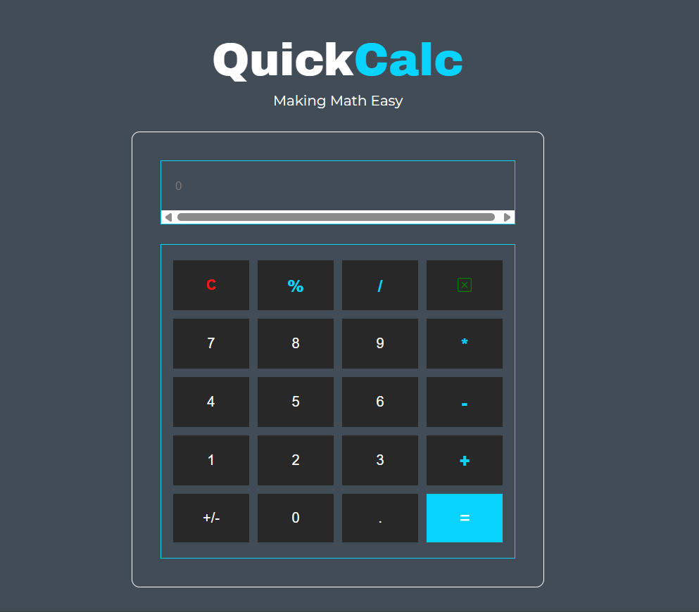

# QuickCalc 🧮


---

## 🚀 Overview
**QuickCalc** is a simple, user-friendly web-based calculator built using **HTML, CSS, and JavaScript**.  
It allows users to perform basic arithmetic operations quickly and efficiently, with a clean, responsive interface.

---

## ✨ Key Features
✅ **Basic Arithmetic** – Addition, Subtraction, Multiplication, Division.  
✅ **Clear & Reset** – Easily clear the current input.  
✅ **Responsive Design** – Works seamlessly on desktop and mobile devices.  
✅ **Interactive Buttons** – Smooth button click feedback.  
✅ **Lightweight & Fast** – No dependencies, purely front-end.

---

## 🛠️ Technologies Used
- **HTML5** – Structure and content  
- **CSS3** – Styling and layout  
- **JavaScript (ES6+)** – Logic and interactivity  
- **Images** – Logo and icons for UI enhancement  

---

## ⚙️ Installation & Setup
1. **Clone the repository:**
```bash
git clone https://github.com/ravi-kumar-chinta/QuickCalc.git
```
```bash
cd QuickCalc
```
---
## 📂 File Structure

```bash
.
├── assets/
│   ├── css/
│   │   └── style.css        # Styling for the calculator
│   ├── images/
│   │   ├── banner.png       # Banner image
│   │   ├── logo.png         # Logo image
│   │   └── Screenshot.png   # Screenshot of the calculator
│   └── js/
│       └── script.js        # JavaScript logic for the calculator
├── index.html               # Main HTML file
└── README.md                # Project documentation


```
## 🎮 How to Use QuickCalc

- Enter numbers by clicking the buttons or using your keyboard.  
- Use arithmetic operators (+, -, ×, ÷) to perform calculations.  
- Press `=` to see the result.  
- Press `C` to clear the current input.  

---

## 🖼️ QuickCalc Preview

- Here’s how the calculator looks:




---

## ✅ Conclusion

- QuickCalc is a lightweight and fast calculator app for basic arithmetic operations.  
- Built using **HTML, CSS, and JavaScript** without any frameworks.  
- Designed to be responsive and easy to use on any device.  

---

## 🎉 Enjoy QuickCalc!

Use QuickCalc for quick calculations anytime, anywhere! 🚀
